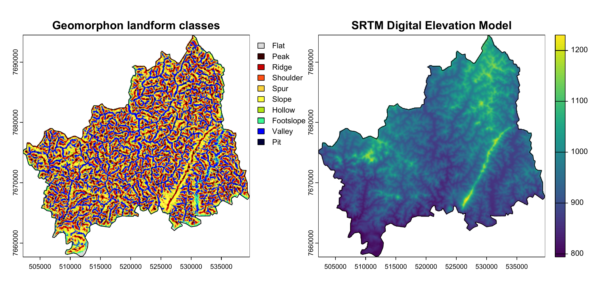

# An Open-Source Geocomputation Pipeline for Municipal Landscape Assessment

> From Territorial Delimitation to Geomorphological Classification

[](https://www.r-project.org/)
[](https://www.gnu.org/licenses/gpl-3.0)
[]()
[]()

---

## Overview

This repository contains the complete reproducible pipeline for the manuscript:

> **"An Open-Source Geocomputation Pipeline for Municipal Landscape Assessment: From Territorial Delimitation to Geomorphological Classification"**
>
> *Vitor Augusto Ferreira et al.* — Universidade Federal de Lavras (UFLA)

Traditional GIS workflows rely on manual operations and fragmented graphical interfaces, limiting reproducibility. This work proposes a fully scripted pipeline in R that allows any researcher to replicate or extend the analysis to any Brazilian municipality by changing only the IBGE municipality code.

---

## Results Preview


---

## Pipeline Architecture

The methodology is organized into three operational modules:

### Module 1 — Territorial Delimitation
- Automated retrieval of official municipal boundaries using `geobr` and `sf`
- Data sourced directly from Brazilian government databases (IBGE)

### Module 2 — Elevation Data Processing
- Dynamic download of SRTM satellite elevation data
- In-memory clipping and filtering using the `terra` framework
- No temporary files written to disk — reduces conversion errors and increases speed

### Module 3 — Landform Classification
- Execution of the `geomorphons` algorithm
- Computer vision technique identifying 10 landform units (valleys, peaks, slopes, ridges, etc.)
- Based on terrain visibility patterns

---

## Case Study: Bom Sucesso, Minas Gerais

The pipeline was validated in the municipality of **Bom Sucesso, MG, Brazil**.

| Metric | Value |
|--------|-------|
| Minimum elevation | 790 m |
| Maximum elevation | 1,232 m |
| Mean elevation | 942.7 m |
| Dominant landform | Valleys (23.6%) |
| Second dominant | Ridges/Crests (20.73%) |
| Flat areas | 0.62% |

> The near-absence of flat terrain imposes significant restrictions on agricultural mechanization and urban expansion.

---

## Installation

```r
# Install required packages
install.packages(c("terra", "sf", "geobr", "MultiscaleDTM"))
```

Tested on R >= 4.2.0.

---

## Reproducibility

To reproduce the analysis for **Bom Sucesso (MG)**, run the scripts in order:

```r
source("R/01_territorial_delimitation.R")
source("R/02_elevation_processing.R")
source("R/03_landform_classification.R")
```

To apply the pipeline to any other municipality, change the IBGE code in `01_territorial_delimitation.R`:

```r
# Change this code to any Brazilian municipality
ibge_code <- 3107406  # Bom Sucesso, MG
```

---

## Dependencies

| Package | Purpose |
|---------|---------|
| `terra` | Raster processing in-memory (C++ backend) |
| `sf` | Vector spatial data |
| `geobr` | Brazilian official spatial data |
| `rgeomorphon` | Geomorphons landform classification |

---

## Citation

If you use this pipeline, please cite:

```
Ferreira, V.A., Alves, M.C., Campos, G.A.O., Schneider, B.O., & Silva, F.M. (2026).
An Open-Source Geocomputation Pipeline for Municipal Landscape Assessment: From
Territorial Delimitation to Geomorphological Classification.
Received: June 12, 2026 — Accepted: July 15, 2026. DOI: [to be assigned]
```

```bibtex
@article{ferreira2026geocomputation,
  title   = {An Open-Source Geocomputation Pipeline...},
  author  = {Ferreira, Vítor Augusto and ...},
  year    = {2026},
  doi     = {[to be assigned]}
}
```


---

## License

This project is licensed under the [GNU General Public License v3.0](LICENSE).

---

## Contact

**Vitor Augusto Ferreira - vitor.ferreira4@ufla.br**
Universidade Federal de Lavras (UFLA)

**Marcelo de Carvalho Alves - marcelo.alves@ufla.br**
Universidade Federal de Lavras (UFLA)

